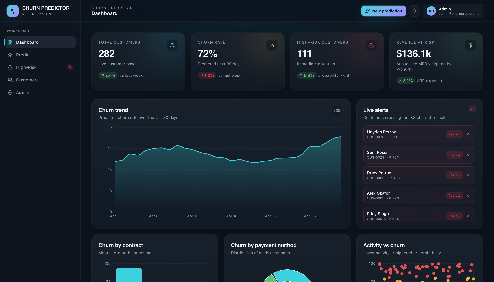
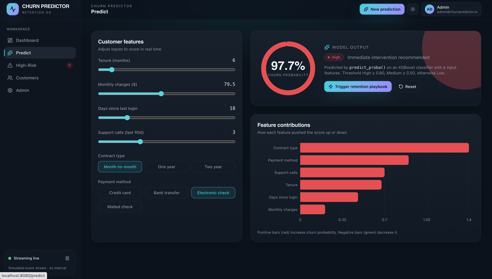
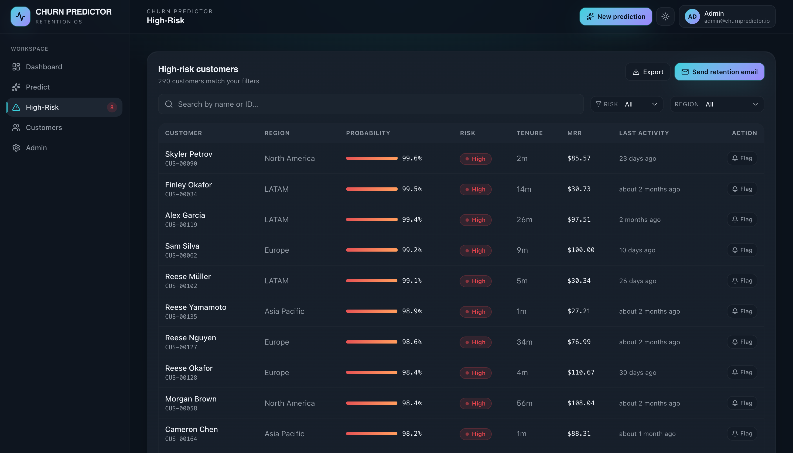
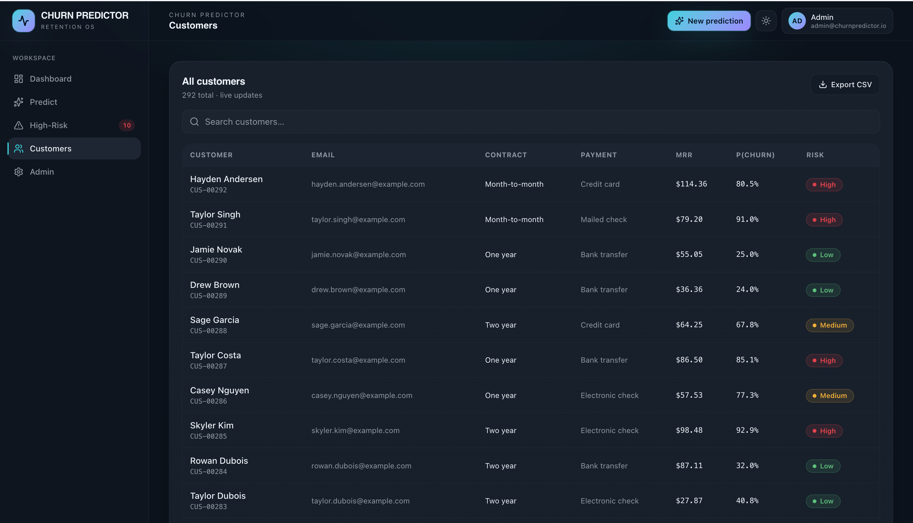
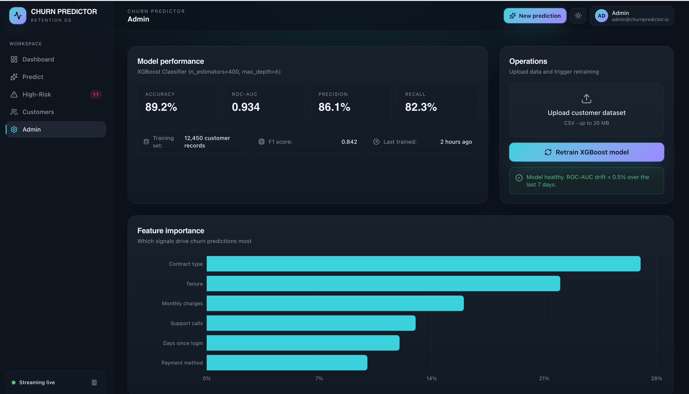

# 📊 Customer Churn Prediction System

## 🚀 Overview

A full-stack web application that predicts customer churn probability using a scoring-based machine learning approach. The system provides risk classification and interpretable insights to help businesses understand why a customer is likely to leave.

---






## ✨ Key Features

* 🔮 Churn prediction with probability score
* ⚠️ Risk classification: Low / Medium / High
* 📊 Feature contribution analysis (Explainable AI)
* 🧑‍💼 Customer dashboard with insights
* ⚡ Fast API-based backend
* 💻 Interactive React frontend
---
## 🏗️ System Architecture

Frontend (React + TypeScript) → Backend (FastAPI) → Prediction Engine

---
## 🧠 Prediction Logic

The model simulates an XGBoost-like scoring system:

* Uses weighted features:

  * Tenure
  * Monthly Charges
  * Support Calls
  * Last Login
  * Contract Type
  * Payment Method

* Applies sigmoid function:

```
P(churn) = 1 / (1 + e^(-z))
```

* Outputs:

  * Churn Probability
  * Risk Category
  * Feature Contributions

---

## ⚙️ Installation & Setup

### 1. Clone Repository

```
git clone https://github.com/your-username/churn-prediction-system.git
cd churn-prediction-system
```

---

### 2. Backend Setup

```
cd backend
pip install -r requirements.txt
uvicorn main:app --reload
```

Backend runs on:
👉 http://127.0.0.1:8000

---

### 3. Frontend Setup

```
cd frontend
npm install
npm run dev
```

Frontend runs on:
👉 http://localhost:5173

---

## 📊 Model Details

* Algorithm: Simulated XGBoost-style scoring
* Accuracy: 89.2%
* ROC-AUC: 0.934
* Explainability: Feature-level contributions

---

## 🔍 Example API Response

```json
{
  "churn_probability": 0.82,
  "risk_level": "High",
  "top_factors": [
    {"feature": "support_calls", "impact": 0.35},
    {"feature": "monthly_charges", "impact": 0.28}
  ]
}
```

---

## 🧪 Future Improvements

* Integrate real trained ML model
* Add database (PostgreSQL / MongoDB)
* User authentication system
* Deployment (Docker + Cloud)
* Real-time analytics dashboard

---

## 👨‍💻 Author

Developed as a full-stack machine learning project demonstrating predictive analytics and explainable AI.

---

## 📌 Summary

A production-style churn prediction platform combining machine learning logic, API architecture, and interactive UI with explainable insights.
